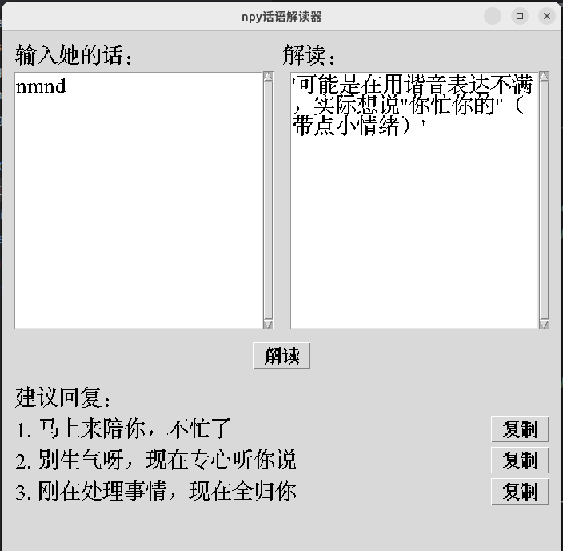

# NPY 话语解读器

[](https://www.python.org/) [](https://opensource.org/licenses/MIT)

**还在为听不懂女朋友/媳妇的弦外之音而烦恼吗？这款神器帮你一键解读，轻松应对各种"送命题"！** 😉

NPY 话语解读器是一款基于大语言模型（LLM）的桌面应用，旨在帮助你理解伴侣话语背后的真实意图、情感和期望。告别猜谜游戏，建立更顺畅的沟通！

## ✨ 主要功能

*   **深度解读**：输入伴侣的一句话，获取 AI 基于情景和普遍情感理解给出的深度解读，揭示潜台词和真实想法。
*   **高情商回复建议**：针对解读结果，提供多条（默认为 3 条）精炼、贴切的回复建议，帮你优雅化解尴尬，传递关怀。
*   **一键复制**：方便地复制建议回复，快速应用到你的聊天中。
*   **简洁界面**：使用 Tkinter 构建，界面直观易用，操作简单。
*   **模型灵活**：支持配置不同的 OpenAI 兼容 API 地址和模型（默认使用 OpenRouter 的免费模型）。

## 🚀 工作原理

本应用通过一个图形用户界面（Tkinter）接收用户输入的文本。当用户点击"解读"按钮时，应用会将输入的文本，结合一个精心设计的系统提示词（System Prompt），发送给配置好的大语言模型（通过 `LLMClient`）。该提示词引导模型扮演一个情商高、富有同理心的朋友或顾问角色，分析话语并生成解读和回复建议。最后，应用解析模型的返回结果，清晰地展示在界面上。

## 📸 应用截图


## 🛠️ 安装与设置

1.  **克隆仓库**:
    ```bash
    git clone https://github.com/wangyuanchuan2022/npy_translator.git
    cd npy_translator
    ```

2.  **创建虚拟环境** (推荐):
    ```bash
    python -m venv venv
    source venv/bin/activate  # Linux/macOS
    # venv\Scripts\activate  # Windows
    ```

3.  **安装依赖**:
    ```bash
    pip install -r requirements.txt
    ```

4.  **设置环境变量**:
    应用需要 API 密钥和模型信息才能连接到 LLM 服务。推荐创建一个 `.env` 文件存储这些敏感信息。

    *   在项目根目录下创建一个名为 `.env` 的文件。
    *   在该文件中添加以下内容，并替换为你的实际信息：

        ```dotenv
        # 必填: 你的 OpenAI 兼容 API 密钥
        OPENAI_API_KEY="你的API密钥"

        # 可选: API 的基础 URL (默认为 OpenRouter)
        # 如果使用 OpenAI 官方 API，可以设置为 https://api.openai.com/v1
        OPENAI_BASE_URL="https://openrouter.ai/api/v1"

        # 可选: 使用的模型名称 (默认为 OpenRouter 上的免费模型)
        # 示例: OPENAI_DEFAULT_MODEL="openai/gpt-3.5-turbo"
        OPENAI_DEFAULT_MODEL="deepseek/deepseek-chat-v3-0324:free"
        ```

    **重要**:
    *   确保 `.env` 文件被添加到了你的 `.gitignore` 文件中，以防止 API 密钥泄露。
    *   你需要拥有一个 OpenAI 兼容的 API 密钥。你可以从 OpenAI 官网获取，或者使用像 OpenRouter 这样的第三方服务（它可能提供免费模型额度）。

## ▶️ 如何使用

确保你已经完成了安装和设置步骤，并且激活了虚拟环境。

在项目根目录下运行以下命令启动应用：

```bash
python translator_app.py
```

然后，在"输入她的话"文本框中输入你想解读的内容，点击"解读"按钮即可。

## 💻 技术栈

*   **语言**: Python 3
*   **GUI**: Tkinter
*   **LLM 交互**: `openai` Python 库 (兼容 OpenAI API)
*   **配置管理**: `python-dotenv`

## 🤝 贡献

欢迎提出改进建议或贡献代码！请通过 Issue 或 Pull Request 进行。

## 📄 许可证

本项目采用 [MIT 许可证](LICENSE)。